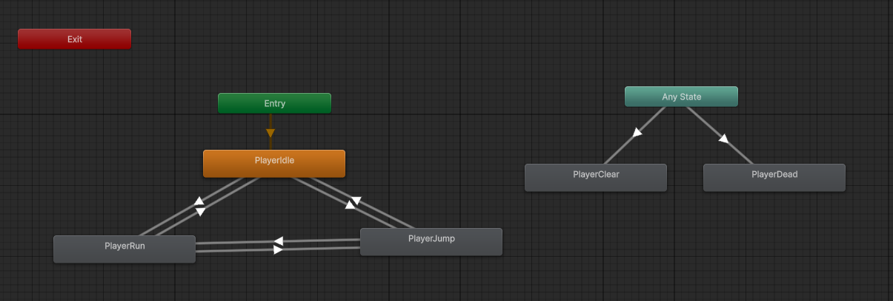
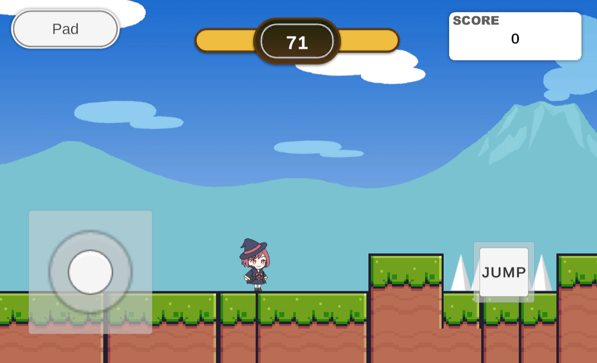

# JewelryHunter_Unity6

[ゲームのサンプルプレイ](https://azumasato4.github.io/JewelryHunter_Web/)


## 訓練校で学習する初2D作品
* Playerの動作
* アニメーションの作り方
* タグやレイヤーの使い方
など基本を学んでいます。

## 制作のポイント
### アニメーションをトランジションで作成

Playerのアニメ切り替えには各クリップをトランジションでつないでフラグで管理しました。トランジションを組み込むことで、アニメ切り替えが滑らかになり、かつコーディングが効率的なものになりました。



## Itemのコーディング

Itemは列挙型のItemColorを自作して、ItemColor型の変数次第で何色が選ばれているのかにより見た目が変わるようなコーディングの工夫をしました。

```c#
using UnityEngine;

public enum ItemColor
{
    White,
    Blue,
    Green,
    Red
}

public class ItemData : MonoBehaviour
{
    public ItemColor colors = ItemColor.White;
    public Sprite[] itemSprites;

    public int value = 0;

    // Start is called once before the first execution of Update after the MonoBehaviour is created
    void Start()
    {
        SpriteRenderer spriteRenderer = GetComponent<SpriteRenderer>();

        switch (colors)
        {
            case ItemColor.White:
                spriteRenderer.sprite = itemSprites[0];
                break;
            case ItemColor.Blue:
                spriteRenderer.sprite = itemSprites[1];
                break;
            case ItemColor.Green:
                spriteRenderer.sprite = itemSprites[2];
                break;
            case ItemColor.Red:
                spriteRenderer.sprite = itemSprites[3];
                break;
        }
    }

    // Update is called once per frame
    void Update()
    {
        
    }
}

```

## TextMeshProのデザイン切り分け

TextMeshProのデザインを細かく切り分けてデータを用意するなど工夫をしました。


## オリジナルポイント

授業とは別に調べながらバーチャルパッドを実装してみました。

```c#
//Velocityの元となる値の取得（右なら1.0f、左なら-1.0f、なにもなければ0）
axisH = Input.GetAxisRaw("Horizontal");
if (Gamepad.current != null)
{
    //バーチャルパッドが表示されていたらaxisHの入力元を変える
    var stickValue = Gamepad.current.leftStick.ReadValue();
    axisH = stickValue.x;
}
```


