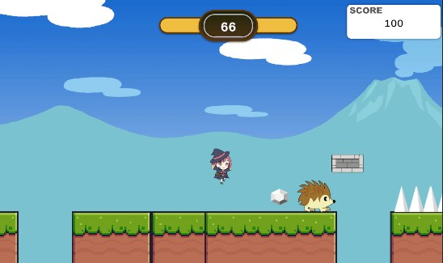

# JewelryHunter_Unity6

[ゲームのサンプルプレイ](https://azumasato4.github.io/JewelryHunter_Web/)

## 訓練校で学習する初2D作品
* Playerの動作
* アニメーションの作り方
* タグやレイヤーの使い方
など基本を学んでいます。

## 制作のポイント
### アニメーションをトランジションで作成

Playerのアニメ切り替えには各クリップをトランジションでつないでフラグで管理しました。トランジション滑らかに

